# MERN Practice

Mongo + Fastify + React + Node

## Create frontend (React) project

```
npx create-react-app frontend --template typescript
...
```

## Create backend (Fastify) project

[ref](https://www.fastify.io/docs/latest/TypeScript/)

```
mkdir backend
cd backend
npm init -y
npm i fastify fastify-static pino-pretty mongoose dotenv
npm i -D typescript @types/node @types/mongoose
npx tsc --init
npm i -D concurrently nodemon
...
```

# Quickstart with Gitpod

Step by step tutorial about how to start using Gitpod on MERN Practice project.

### 1. Sign in to GitHub
Click `Sign in`.
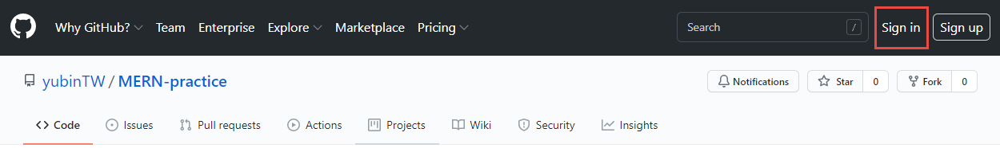
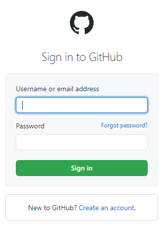

### 2. Fork the MERN-practice repository
Click `Fork`.
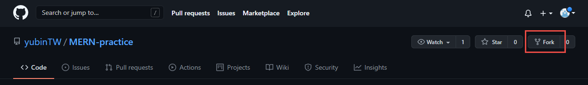
If you have other organizations, please select your own account.
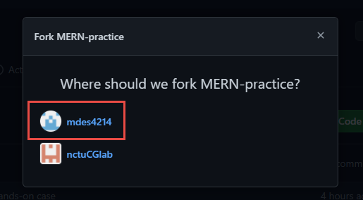
And then you will see the fork message under the repository title.
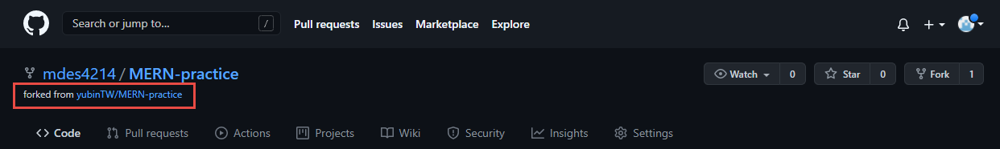

### 3. Go to [https://gitpod.io](https://gitpod.io)
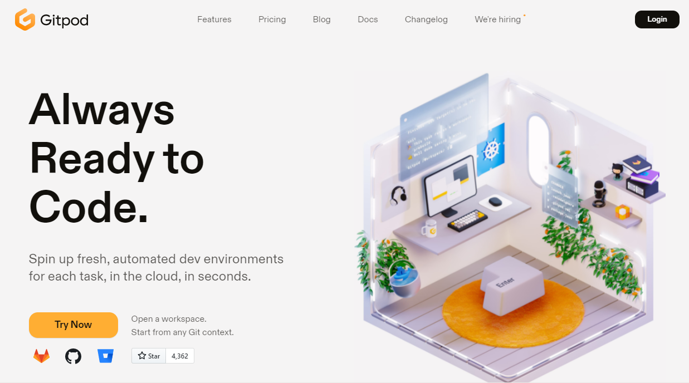

### 4. Log in Gitpod with GitHub account
Click `Login`

Click `Continue with GitHub`
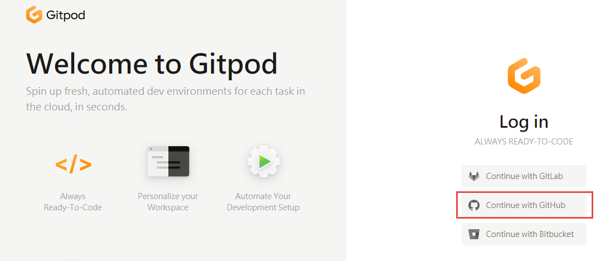
Check your account is correct.
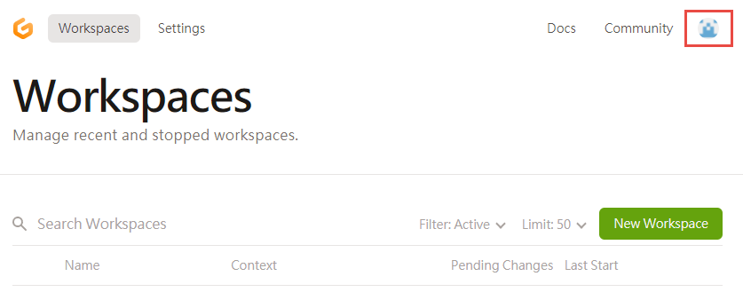

### 5. Create workspace with git repository URL
Open a new tab of browser, and type in `https://gitpod.io/#https://github.com/{YOUR_GITHUB_ACCOUNT}/MERN-practice`.
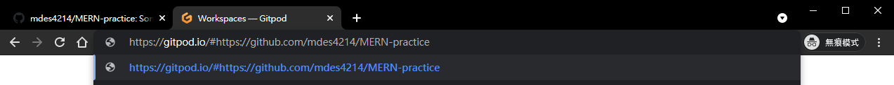
After processing, the page will jump to Gitpod editor.
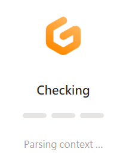
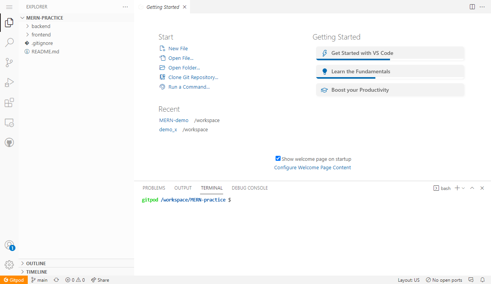


### 6. Grant git privilege to Gitpod
Back to the [https://gitpod.io](https://gitpod.io), and click `Settings`.
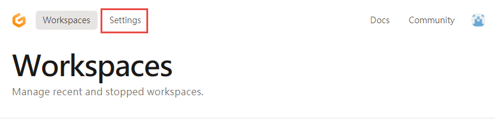
Select `Integrations` and then `Edit Permissions`.
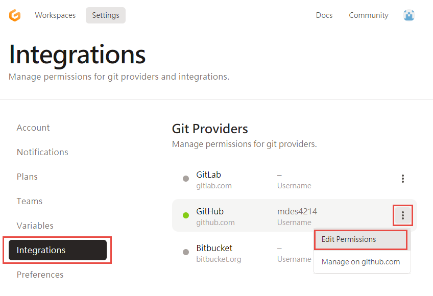
Check `public_repo`, which will grant Write privilege of your public git repository to Gitpod, and then click `Update Permissions`.
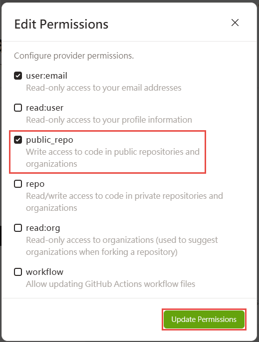

### (Optional) Change your Gitpod theme to Visual Studio dark theme
Press `F1` in Gitpod editor and select `Preferences: Color Theme`.
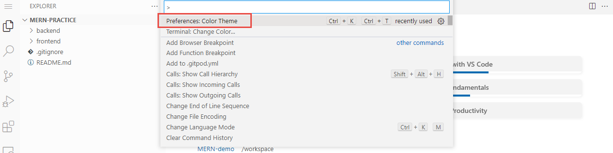
Select `Dark (Visual Studio)` (or other themes you like).
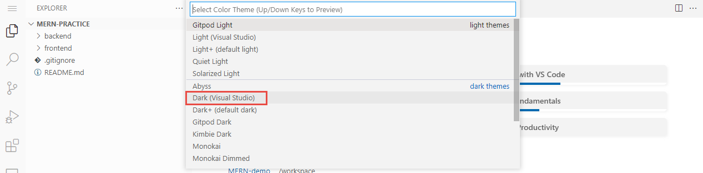
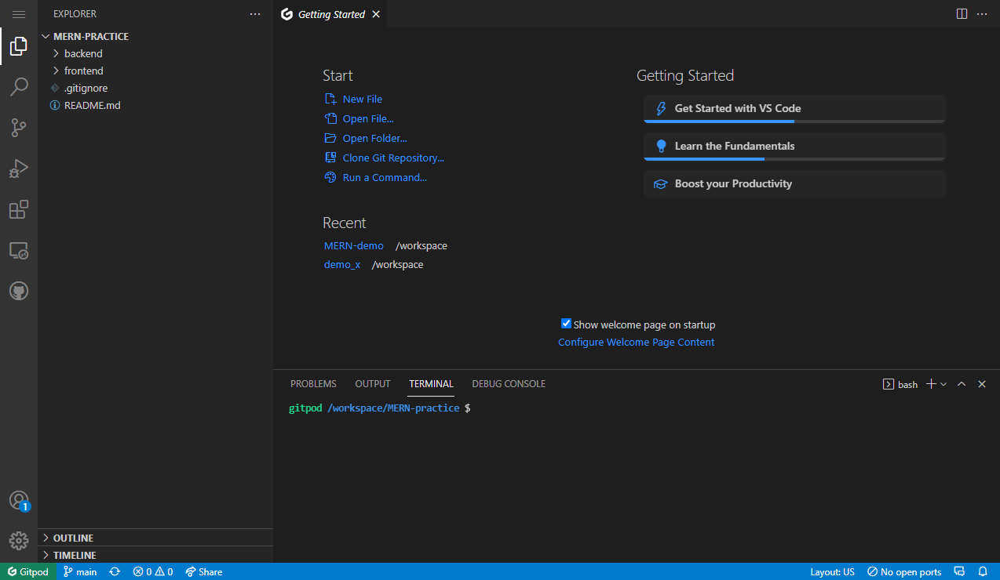

### 7. Create own branch
First check your current branch: `git status`.
```console
git status
```
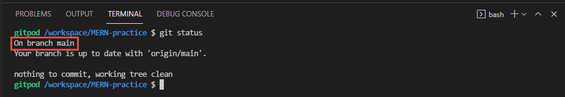

Create local branch: `git checkout -b {YOUR_ACCOUNT_OR_NAME}_dev`, e.g.
```console
git checkout -b ym_dev
git status
```
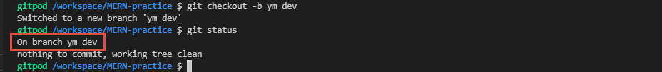

Create remote branch and link: `git push -u origin {SAME_AS_YOUR_LOCAL_BRANCH}`, e.g.
```console
git push -u origin ym_dev
git status
```
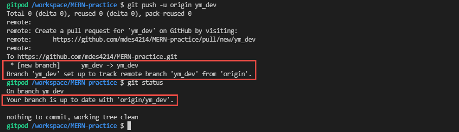

After above steps, you can find your own branch in GitHub.
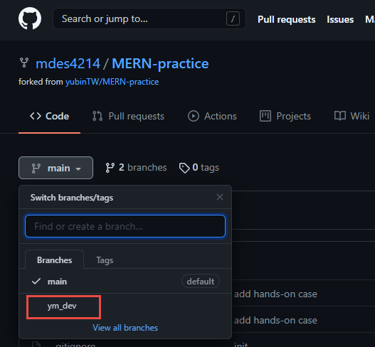

### 8. Push your changes
After coding, if you want to push your changes, first check your current branch and changed files: `git status`.
```console
git status
```
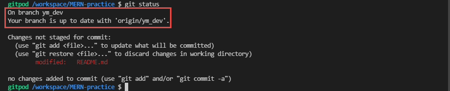

Add all changes: `git add .`, and then commit: `git commit -m "{SOME_MEANINGFUL_COMMENT}"`.
```console
git add .
git commit -m "add gitpod tutorial"
```
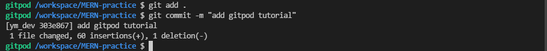

Push to remote repository: `git push`, and check the commit log: `git log`
```console
git push
git log
```
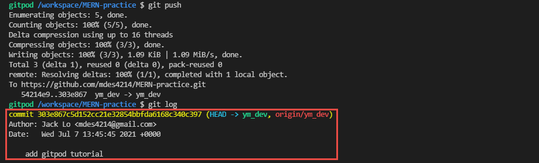
